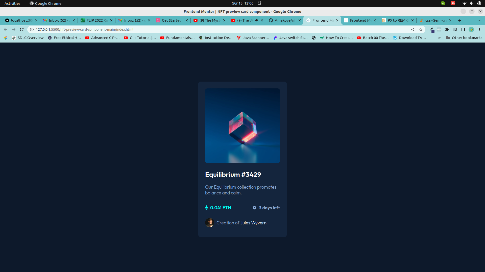
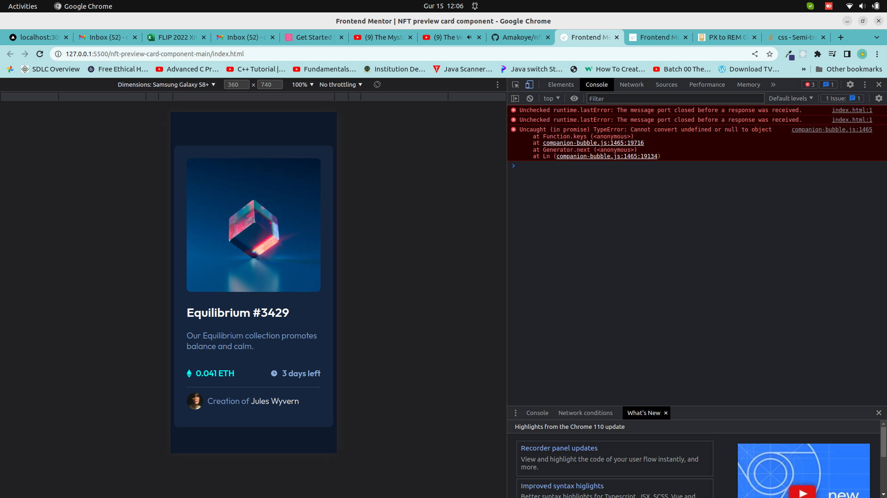

# Frontend Mentor - NFT preview card component solution

This is a solution to the [NFT preview card component challenge on Frontend Mentor](https://www.frontendmentor.io/challenges/nft-preview-card-component-SbdUL_w0U). Frontend Mentor challenges help you improve your coding skills by building realistic projects.

## Table of contents

- [Overview](#overview)
  - [The challenge](#the-challenge)
  - [Screenshot](#screenshot)
  - [Links](#links)
- [My process](#my-process)
  - [Built with](#built-with)
  - [What I learned](#what-i-learned)
- [Author](#author)

## Overview

### The challenge

Users should be able to:

- View the optimal layout depending on their device's screen size
- See hover and focus states for interactive elements

### Screenshot

### Links

- Solution URL: [github link](https://github.com/Amakoye/nft-preview-card-component-main.git)
- Live Site URL: [demo link](https://nft-preview-card-component-main-kappa-two.vercel.app/)

## My process

### Built with

- Semantic HTML5 markup
- CSS custom properties
- Flexbox

## Author

- Website - [Amakoye Charles](https://github.com/Amakoye)
- Frontend Mentor - [@Amakoye](https://www.frontendmentor.io/profile/Amakoye)
- Twitter - [@charlesamakoye](https://www.twitter.com/charlesamakoye)
